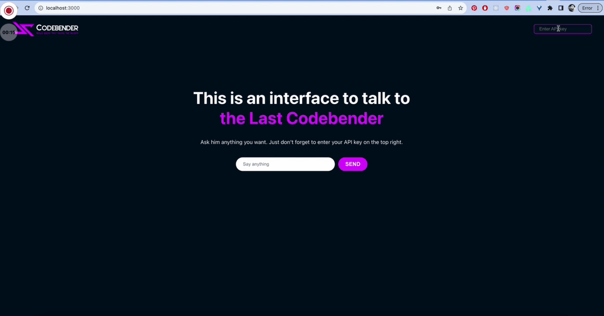

# Codebender AI Starter Project - JS version

This is a starter code you can clone to build your first AI project in JavaScript✊

It's a simple chat interface that allows you to talk with the Last Codebender.

It utilizes the OpenAI gpt-3.5-turbo model for chat completion.

PS: You need to enter your API key in the top right to use the app. You can find your key [here](https://platform.openai.com/api-keys) after you create an account on https://platform.openai.com.

## How to run the app on your local computer

1. Clone the git repo. Follow [these instructions](https://blog.hubspot.com/website/clone-github-repository) if you don't know how to do it.
   - If you are a beginner and wonder which terminal to use, I recommend [iTerm](https://iterm2.com/) for Mac users and [Git bash](https://www.git-scm.com/downloads) (or just the VS Code terminal) for Windows users.
2. Open the app folder in your favorite IDE (I use VSCode).
3. Open your terminal and run `yarn` to install the dependencies for the app.
4. Once this is done, run `yarn start` in your terminal.
5. Your app should now be running in development mode. Visit http://localhost:3000 to view it in your browser.
